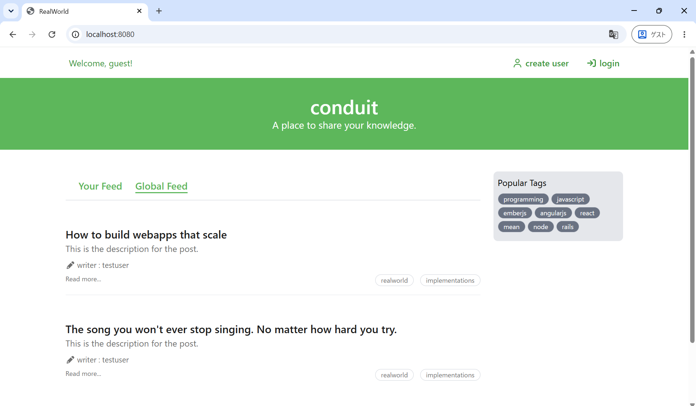
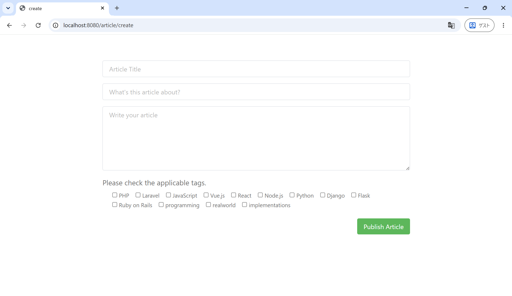
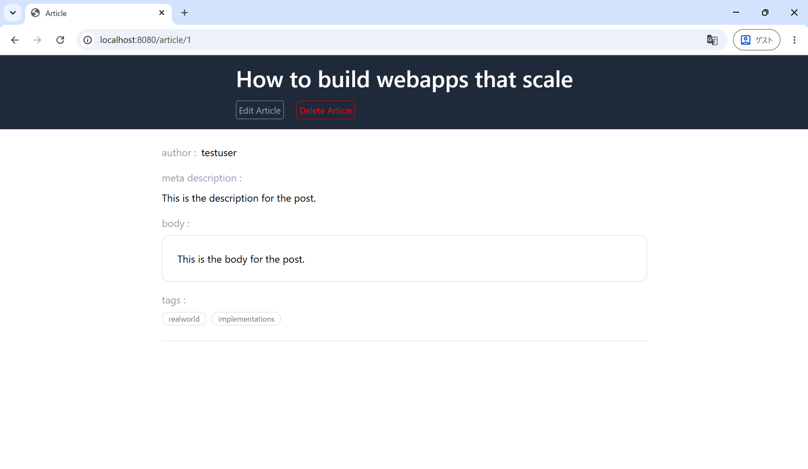

# RealWorld
アプレンティス「Laravel編」の提出課題になります。

## 概要

RealWorldというフレームワークを学習するために作成されたプロジェクトがあり、その中の「Conduit」という架空のブログサイト作成に取り組みました。
基本的なCRUD操作＋認証・認可の処理をLaravelで実装しました。

主な仕様は以下の通りです。

- ホーム画面には投稿された記事を一覧表示する
- 記事はタイトル、サブタイトル、本文、タグの4項目を記入＆タグは3つまで選択可能
- 記事は投稿者本人のみ編集/削除操作を行うことができる
- 記事一覧は未ログインでも閲覧可能
- 記事の投稿/編集/削除はログイン状態でのみ実行可能
- 記事の編集/削除は投稿者本人のみ操作可能

操作を体験いただけるよう、サンプルユーザを用意しています。

| Email            | Password |
| ---------------- | -------- |
| test@example.com | password |

また、主な画面のUIは以下のようになっています。

#### ホーム画面


#### 投稿画面


#### 閲覧画面


## 使用方法
ローカル環境で動作させるための手順をここでは紹介します。

> [!WARNING]
> `Linux`と`Docker`環境が必要になります。

### ソースコードの取り込み
最初に任意のディレクトリに移動し、ソースコードをお手元のPCに取り込みます。
```bash
git clone https://github.com/yoshidasyoki/QUEST_realworld.git .
```

`ls`コマンドで確認し、以下のようなディレクトリ・ファイル構造となっていればOKです。
```
# 実行結果
README.md  compose.yml  docker  set_container_user.sh  src
```

### 環境変数の設定
イメージのビルド＆コンテナ起動時に必要となる環境変数の設定を行います。

まずはDB動作に必要な環境変数を設定します。
`docker/db`ディレクトリ下へ移動し、`db_variables.env`という名前のファイルを作成します。そして以下のように環境変数を設定します。

```env
MYSQL_ROOT_PASSWORD=pass
MYSQL_DATABASE=laravel_db
MYSQL_USER=laravel_user
MYSQL_PASSWORD=pass
```

次にシェル変数の設定を行います。`compose.yml`と同階層の位置に戻り、以下のコマンドを実行します。
```bash
source ./set_container_user.sh
```

`env`コマンドでLinux側の環境変数を確認し、以下のように`HOST_UID`と`HOST_GID`が設定されていれば設定は完了です。
```bash
env | grep "HOST*"
```

↓ 実行結果（番号は環境によって異なる可能性あり。このようになっていればOKです）
```bash
HOST_UID=1000
HOST_GID=1000
```

### Docker環境の構築
以下コマンドでイメージビルドとコンテナの起動を行います。
```bash
docker compose up -d
```

処理が終わったらコンテナが正常に起動していることを以下コマンドで確認します。
```bash
docker compose ps
```

このような形で`app`、`db`、`nginx`コンテナがそれぞれ起動していればOKです。
```bash
NAME                IMAGE             COMMAND                  SERVICE   CREATED         STATUS                  PORTS
realworld-app-1     realworld-app     "docker-php-entrypoi…"   app       4 seconds ago   Up 3 seconds            0.0.0.0:9000->9000/tcp, [::]:9000->9000/tcp
realworld-db-1      realworld-db      "docker-entrypoint.s…"   db        4 seconds ago   Up 3 seconds            0.0.0.0:3306->3306/tcp, [::]:3306->3306/tcp
realworld-nginx-1   realworld-nginx   "/docker-entrypoint.…"   nginx     3 seconds ago   Up Less than a second   0.0.0.0:8080->80/tcp, [::]:8080->80/tcp
```

### アプリの設定
ここまででインフラ部分は完成したので、次はアプリ側のセットアップを行っていきます。

以下コマンドでまずコンテナ内へ入ります。
```bash
docker compose exec app bash
```

コンテナ内へ入ることができたら以下コマンドを実行し、Laravelのインストール等を行います。
```bash
composer require -n
```

無事処理が完了したら次に、アプリ動作に必要な環境変数を設定していきます。以下コマンドでアプリの環境変数を管理する`.env`ファイルを作成します。
```bash
cp .env.example .env
```

`.env`ファイルのうち以下の部分を変更します。
```env
DB_CONNECTION=mysql       # sqlite → mysqlへ変更
DB_HOST=db                # 127.0.0.1 → DBコンテナ名へ変更
DB_PORT=3306
DB_DATABASE=laravel_db    # laravel → 設定したデータベース名へ変更
DB_USERNAME=laravel_user  # root → 設定したユーザ名へ変更
DB_PASSWORD=pass          # 設定したパスワードを記述
```

次に以下コマンドを実行し、Laravelが動作するようにします。
```bash
php artisan key:generate
```

このコマンドも成功したらマイグレーションを行い、必要なテーブルを作成します。
```bash
php artisan migrate
```

そしてアプリの動作に必要となる、初期データの作成を行います。
```bash
php artisan db:seed
```

ここまででアプリ自体は一応動作するようにはなります。ただしこの状態ではまだ`TailwindCSS`のスタイルが当たっていない状態なので最後にこの部分の調整を行っていきます。
以下コマンドで`TailwindCSS`が扱える環境を作成します。
```bash
npm install
```

その後、以下コマンドでスタイル当てを実行します。
```bash
npm run build
```

`✓ built in`という表示がでれあば処理は成功になります。
この状態で以下のURLをブラウザに打ち込むとアプリのホーム画面が表示されます。これでセットアップは完了になります。
```
localhost:8080
```
